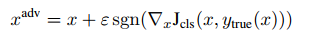
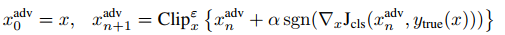
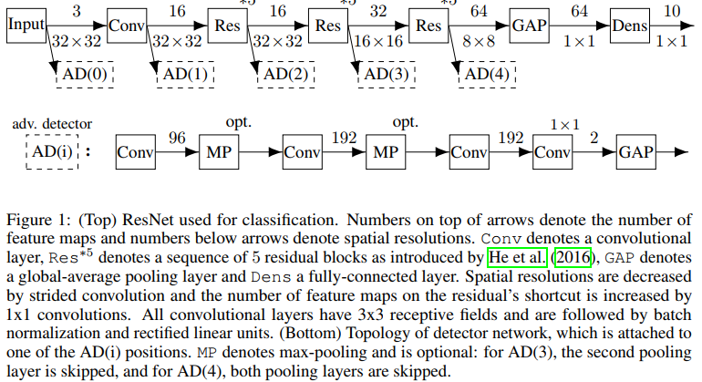
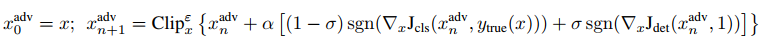

通过增加鲁棒性来防御对抗性攻击，使对抗样本能够正确分类的工作：
* Explaining and Harnessing Adversarial Examples (argument training data，减少对抗样本和良性样本的loss)
* Improving the Robustness of Deep Neural Networks via Stability Training. (训练模型时在目标函数中增加一个固定项来使得对抗样本也能得到正确输出)
* A study of the effect of JPG compression on adversarial images.(apply JPEG compression)
* Distillation as a Defense to Adversarial Perturbations against Deep Neural Networks.(network instillation,能有效对抗L-BFGS和Fast Gredient Sign Attack)
* Measuring neural net robustness with constraints.  
* Towards deep neural network architectures robust to adversarial examples.
* Learning with a strong adversary.
* Robust Convolutional Neural Networks under Adversarial Noise.
* Adversarial diversity and hard positive generation.
* Understanding Adversarial Training: Increasing Local Stability of Neural Nets through Robust Optimization.

检测对抗样本
* ON DETECTING ADVERSARIAL PERTURBATIONS
* Dimensionality Reduction as a Defense against Evasion Attacks on Machine Learning Classifiers.
* Detecting Adversarial Samples from Artifacts.
* Adversarial and Clean Data Are Not Twins.
* On the (Statistical) Detection of Adversarial Examples.
* On Detecting Adversarial Perturbations.
* Early Methods for Detecting Adversarial Images.
* Adversarial Examples Detection in Deep Networks with Convolutional Filter Statistics.

***
论文：LaVAN: Localized and Visible Adversarial Noise

攻击方法：
* Towards Evaluating the Robustness of Neural Networks.(可以使得包括distillation等大部分防御失效)
* Intriguing properties of neural networks. (L-BFGS attack)
* **Explaining and Harnessing Adversarial Examples.** (Fast gredient sign attack) 最大化除了正确分类外的其他分类概率

* Adversarial examples in the physical world.     最小化正确分类概率

* DeepFool: A simple and accurate method to fool deep neural networks. 将图像移向图像空间类间决策边界
* Evasion attacks against machine learning at test time
* The limitations of deep learning in adversarial settings.

Are accuracy and robustness correlated? 

更高准确率的模型对于对抗性攻击更鲁棒，能够混淆高准确率的攻击更容易迁移到低准确率的模型上。

存在对抗性样本的原因：
* Szegedy speculated that the data-manifold is filled with “pockets” of adversarial inputs that occur with very low probability and thus are almost never observed in the test set.
* Goodfellow：linear behavior in high-dimensional spaces is sufficient to cause adversarial examples
* If a learned class boundary lies close to the data manifold, but the boundary is (slightly) tilted with respect to the manifold1, then adversarial examples can be found by perturbing points from the data manifold towards the classification boundary until the perturbed input crosses the boundary. 

***
论文：ON DETECTING ADVERSARIAL PERTURBATIONS

将分类器中间特征作为输入，提供给二值分类器，进行判断是否为敌对样本。

攻击者进行攻击时需要同时考虑分类网络和检测网络。

先用良性训练集训练原始模型，然后固定原始模型，用构造的对抗样本训练二值分类器。

***
论文：Adversarial Examples Are Not Easily Detected: Bypassing Ten Detection Methods
代码：http://nicholas.carlini.com/code/nn_breaking_detection

此工作针对10种检测防御方法进行测试。

攻击模型：

零知识攻击：攻击者只知道模型F，不知道检测模型D

完全知识攻击：攻击者知道F和D及其模型参数

有限知识攻击：攻击者知道D的存在，知道D如何训练，但不能使用D。

利用CW方法生成对抗样本。

四种检测策略：
+ 使用两个神经网络F和D，分别进行分类和检测
  - 工作（On the (Statistical) Detection of Adversarial Examples.）通过将网络设计成（N+1）分类来训练网络使其能够检测对抗样本。对应的训练过程：
    1. 在训练集$\chi_0 = \chi$上训练模型$F_{base}$;
    2. 对于每个样本$(x_i, y_i) \in \chi$,利用模型$F_{base}$训练得到对应的对抗样本$x'_i$;
    3. 使用数据集$\chi_1 = \chi_0 \bigcup \{x'_i, N+1\}$训练$F_{secured}$.
  - 工作（Adversarial and Clean Data Are Not Twins.）
    1. 与上述方式类似，没有完全重训练得到$F_{sucured}$，而是构造了一个二值分类器，其对应的训练集为$\chi_1=\{(x_i,1):i \in |\chi|\} \bigcup \{ (x'_i, 0): i \in |\chi|\}$.
  - 如上两种方式对采用FGS和JSMA方式的攻击基本上能够达到100%检测成功率。
  - C&W攻击
    - 零知识攻击，用测试集采用CW攻击生成的对抗样本，分别达到98.5%和98%的检测成功率；但在CIFAR上达到70%的检测成功率需要40%的假阳性率。
    - 完全知识攻击，对于两种防御，生成的攻击样本的攻击成功率100%，像素的修改距离分别从2.05增大到2.26和2.31，即在MNIST上检测无效；CIFAR-10上结果类似。
    - 有限知识攻击，将训练集拆成两部分，训练两个检测模型分别用于攻击者和检测者。攻击者有98%成功率。
  - 工作（On Detecting Adversarial Perturbations.）通过以网络中间结果为输入，用额外的神经网络来检测样本是否为良性。
    - 由于它需要ResNet作为分类器，关注于内部ResNet层的结果，ResNet对MNIST不适用，它只能增加针对CIFAR的鲁棒性。
    - 对于FGS或JSMA训练得到的对抗样本，检测精度约99%。
    - 零知识攻击，对于C&W攻击，在28%假阳性的情况下达到81%的真阳性。
    - 完全知识攻击和有限知识攻击，能够在分类错误的前提下瞒过检测器。
+ 使用PCA来检测图像和网络参数的统计属性
  + 输入图像PCA，工作（Early Methods for Detecting Adversarial Images.）发现对抗样本中的主成分对应的权重比良性样本更大。
    + 零知识攻击，在MNIST数据集上，对抗样本和良性样本中较大的主成分相似，但较小的主成分之间存在较大差异。对应的原因是MNist数据集是由24\*24的图像放到28\*28的网格上，其他地方都是0造成的。在CIFAR-0数据集上，没有这种特点，检测无效。
    + 完全知识攻击，可以躲过检测。
  + 维度裁剪，工作（Dimensionality Reduction as a Defense against Evasion Attacks on Machine Learning Classifiers.）将输入从C\*H\*W=N通过全连接或者卷积规约到K维输入，在规约后的输入上进行训练。
    + PCA 会丢失空间信息，因此不能用于卷积网络；
    + 完全知识攻击，对于PCA处理后的网络，对生成样本的鲁棒性和准确率都有所下降。限制攻击者只使用主成分中的最重要的一部分不能有效地限制攻击者。
  +  隐含层进行PCA，工作（Adversarial Examples Detection in Deep Networks with Convolutional Filter Statistics）对中间卷积层进行PCA，然后级联一个分类器来检测对抗样本。
     +  如果所有的分类器认为对应输入是良性的，对应分类为良性；否则，任务输入是对抗样本；每一个分类器使用一个SVM作用于中间特征的PCA上；
     +  在MNIST/CIFAR/IMAGENET上效果都不好。
+ 分布检测，通过检测良性样本和对抗样本的分布
  + 最大平均差异(MMD)，工作（On the (Statistical) Detection of Adversarial Examples）
    + 对于两个输入$X_1$和$X_2$，计算$a=MMD(X_1, X_2)$,将$X_1$和$X_2$重新洗牌，得到$Y_1$和$Y_2$，得到$b=MMD(Y_1, Y_2)$，如果$a<b$，那么推断它们不是同一个分布。多次重复这一过程，将拒绝服从同一分布的比例作为p值；通过测试集得到p=0.05，来判断是否同一分布。
    + 零知识攻击，对于用C&W生成的对抗样本， MMD不能成功识别出来。并且由于MMD时一种很有效的多维统计测试方法，这一结论说明，对输入改变不大的对抗样本，统计测试不能有效地检测。
  + 核密度评估，工作（Detecting Adversarial Samples from Artifacts.）
    + 用高斯混合模型对网络最后一个隐含层的输出建模，声称良性输入和对抗样本的分布不同；
    + 零知识攻击，在MNIST上检测成功，在CIFAR数据集上检测失败；
    + 完全知识攻击和有限知识攻击，扰动平均值为3.81时可以在MNIST数据集检测失败。上面情况在MNIST上的原因是检测方法类似一个对神经网络输出特征的KNN分类器。MNIST上更容易提取。
+ 归一化检测
  + 随机dropout，工作（Detecting Adversarial Samples from Artifacts.）
    + 网络的输出容易被攻击者控制，可以在网络中添加随机性。假设是不管如何随机化，良性输入都能得到正确分类，但对抗样本容易受到随机化的影响。通过dropout来添加随机性。
    + 多次运行网络，每次dropout的神经元不同，通过网络的输出来计算不确定性值。根据不确定性值的大小来判断是否输入为对抗样本。
    + 用FGS和JSMA在MNIST上生成对抗样本时，能在假阳性1%以内情况下使得检测成功率达到96%。
    + 零知识攻击，用C\&W生成对抗样本，能够在MNIST上检测到75%的对抗样本，在CIFAR上95%；
    + 完全知识攻击，98%攻击成功率，MNIST对应平均扰动3.68，CIFAR 1.1；
    + 有限知识攻击，可以通过完全知识攻击迁移。
  + 平均模糊化，工作（Adversarial Examples Detection in Deep Networks with Convolutional Filter Statistics）
    + 用3\*3的平均滤波器处理样本，结果送到分类器。
      + 零知识攻击，80%攻击失败；
      + 完全知识攻击，可以看作是在网络前面添加了一个卷积层，防御失败。

Take-Home Message:
+ 随机化会增加攻击时需要的平均扰动量；
+ MNIST上可行的防御可能在CIFAR上不成立；
+ 用神经网络来检测可以较绕过；
+ 对原始像素值进行操作是无效的。

防御方法研究的建议：
+ 使用更有效的攻击方法；
+ 说明白盒攻击能够失败；
+ 要报告假阳性和真阳性率；
+ 不能只在MNIST上评估；
+ 开放源代码。
