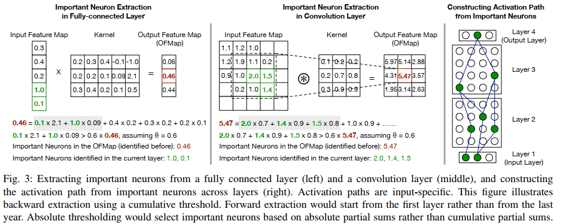
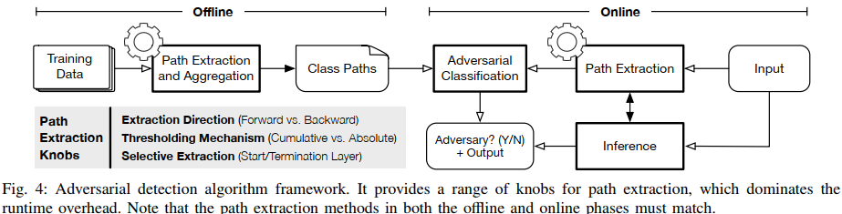
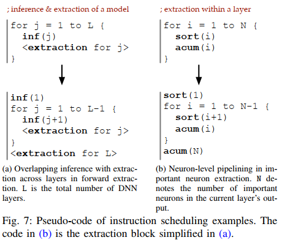

## 摘要
目前针对对抗式攻击的对策要么不能做到推理时实时检测，要么会引入很大额外的开销而使得实施推理不可行。本文提出了一个算法和架构协同设计的系统来力求做到推理时开销尽可能小，同时对对抗样本检测的精度尽可能高。类比DNN推理过程和命令式程序执行过程的共性：DNN的每一个输入对应DNN网络内部的一系列神经元，这些神经元对最后的推理结果的影响很大，而命令式程序中一个输入会激活程序中的一系列基本块，从而执行得到输出。同时注意到，对抗式样本激活的神经元与良性样本激活的神经元有很大差异。利用这一点，作者提出了一个对抗式样本检测框架，通过离线过程中生成针对每个分类结果的金丝雀激活通路，在运行时通过将待检测样本的激活通路与金丝雀通路进行相似性对比来检测。本文提出了`Ptolemy`编译器和对应的协同设计的硬件利用算法的特性来确保其高效执行。评估显示`Ptolemy`相比于当前的机制能够达到更高或相同的检测准确率，但需要非常少的运行时开销（2%）。

## 引文
神经网络非常脆弱，很容易受到攻击，很小的输入扰动都会引起分类错误。对于现实中实用的神经网络系统，它不仅需要能够准确检测出异常输入，也要能够在推理过程中足够高效。本文提出的`Ptolemy`是一个算法架构协同的系统，能够做到很小的额外开销和较高的准确率。使得在推理过程中，程序可以拒绝对抗式攻击得到的错误结果。

目前针对对抗式攻击的已知的对策不能推理时实时检测对抗样本。这些方法通常将DNN的推理当成黑盒，忽略他们的运行时行为。为了促成高效的在线对抗样本检测，本文采用了一种白盒的方法。我们利用这一事实来进行检测：DNN的每个输入会唯一地产生一个激活通路，这个激活通路由一组神经元构成，他们对最终的分类结果有很大的贡献。分析不同的激活路径可以得到如下的观察：同一分类结果对应的输入会执行一组通路，不同分类结果对应的通路之间存在很大的差异。

我们提出了一个通用的算法架构来利用运行时路径行为来进行高效的对抗样本检测。检测框架通过对训练数据进行分析，为每个推理分类构建一个离线的金丝雀类路径。在运行时，为输入构建激活通路，检测其激活通路与相同预测结果的金丝雀路径之间的差异来判断是否为对抗式样本。这个通用算法框架存在一系列影响检测精度和计算成本之间关键权衡的设计问题，例如路径是如何制定的，以及路径是何时构建的。为了拓宽框架的可用性，`Ptolemy`提供了一个高层的编程接口，可以使程序员允许校准算法参数，以探索最适合应用程序需求的精确-成本权衡。

`Ptolemy`提供了高效的执行抽象，执行高效性的重点是`Ptolemy`编译器，它通过发掘检测算法潜在的并行性和冗余来减少检测的开销。我们展示了使用激进的编译优化和自定义的ISA，检测算法可以在现有的DNN加速器上通过一套基本的、有原则的硬件扩展来实现，这进一步扩大了`Ptolemy`的适用性。

`Ptolemy`能够以较低的性能开销实现高度精确的对抗性检测。与目前引入超过10倍性能开销的防御机制相比，我们演示了一个仅用2%性能开销就能实现更高精度的系统。`Ptolemy`不仅防御现有的攻击，而且还可以防御专门为击败我们的防御而设计的自适应攻击。我们还展示了`Ptolemy`框架的灵活性，通过提出一系列算法变体，提供不同的精度-效率折衷。例如，Ptolemy可以用10%的性能开销换取0.03的检测精度。

`Ptolemy`相关的内容，包括预先训练的模型、离线生成的类路径、生成自适应和非自适应攻击的代码，以及检测实现，可以通过 https://github.com/Ptolemy-DL/Ptolemy 获得。`Ptolemy`提供了一个低开销、高精度的在线防御的通用框架，以抵御对抗性攻击，贡献如下:
* 提出了一种新的静态-动态协作的方法来对抗检测，利用独特的程序执行特性的DNN推断;
* 提供了一个通用的算法框架，以及一个高级的编程接口，它允许程序员探索关键的算法设计旋钮，以搜索精确度和效率的权衡空间;
* 演示了使用经过精心设计的ISA，通过利用检测算法框架所暴露的独特并行性和冗余，编译器优化可以实现有效的检测;
* 提出了一个可编程硬件，在现有的DNN加速器基础上通过扩展来实现低延迟在线对抗防御。
  
## 背景
通过轻微扰动来使DNN分类错误的工作：
* Towards evaluating the robustness of neural networks
* Adversarial examples in the physical world
* Distillation as a defense to adversarial perturbations against deep neural networks
* Deepfool: a simple and accurate method to fool deep neural networks
* Image transformation can make neural networks more robust against adversarial examples(图像压缩/噪声也有可能使得分类错误)
  
`Ptolemy`针对普遍的通过输入扰动引入分类，包括小的或大的、无意的或恶意的。自适应攻击是指攻击者完全了解防御系统的内部工作原理，它们是专门设计来试图击败防御系统的。我们证明，我们的检测方案可以防御一系列不同的攻击，包括最强大的形式的攻击:白盒自适应攻击。

**针对对抗攻击的对策**
我们的目标是提供快速和准确的系统能够在推理时检测到攻击样本，以便采取适当的措施。今天的防御机制主要分为两类，但都不符合这一目标。第一类是通过将对抗性样本加入到训练过程中来提升DNN模型的鲁棒性。但重训练需要能够接触到训练数据且对于实时推理不可行。
* Ensemble adversarial training: Attacks and defenses
* Improving the robustness of deep neural networks via stability training
第二类是使用冗余来对抗攻击。这种方式会在推理时引入很大的额外开销，限制其可用性。
* Image transformation can make neural networks more robust against adversarial examples
* Deepfense: Online accelerated defense against adversarial deep learning

## 算法框架

### A. Intuition
每个DNN的输入会激活一系列神经元，同一分类对应的输入的神经元倾向于激活同一系列的神经元，不同分类激活的神经元有很大差异。当前的针对分类模型的稀疏性的研究显示只有一小部分神经元会对最终的结果有贡献且不同分类对应神经元有很大差异。
* Adversarial defense through network profiling based path extraction
* Interpret neural networks by identifying critical data routing paths
从这个角度来看，对抗性样本改变推断结果的方式可以被认为是激活了一系列不同于与其预测输出相关联的规范序列的神经元。从DNN推理中的动态路径进行分析可以是我们检测异常样本。

一组被激活的神经元序列类似于由一个输入程序执行的一组基本块序列。经常使用的基本块序列，即“热路径”，可用于提高经典的配置优化和动态编译器的性能。我们的方法有一个相似的想法，我们把DNN当作一个命令式程序，利用它的运行路径(神经元序列)来指导对抗性样本的检测。常规对策在很大程度上忽略了DNN推理的程序执行行为。

**重要神经元** 
我们的检测算法框架的前提是重要神经元的概念，它表示一组对推理输出有重要贡献的神经元。重要的神经元通过逆向进行提取。最后一层$L_n$只有一个重要的神经元，也就是对应于预测类的神经元n。
在第二层$L_{n-1}$中，重要神经元是输入feature map中能够贡献$L_n$的至少的$\theta (0≤\theta≤1)$的最小神经元集合，在这里，$L_n$控制着重要神经元的覆盖范围。为了提取$L_{n-1}$层中重要的神经元，我们对计算n时使用的部分和进行简单的排序，并选择部分和的总和至少等于$n*\theta$的$L_{n-1}$层的最小神经元数目。

图3左侧显示了一个全连接的例子，假设$\theta=0.6$，输出feature的第二个feature map是重要神经元，那么输入神经元中第4个和第5个神经元贡献了两个较大的部分和且贡献了超过60%的值，所以这两个神经元也是重要神经元。同理，对于卷积层，图3中间的例子，对于输出中的重要神经元，找到其在输入中的感受野，然后寻找感受野中最小的神经元集合，可以使得部分和不小于$\theta * n$。如图3右侧所示，整个过程从最后一层迭代反向传播到第一层。第$L_i$层的重要神经元用于决定第$L_{i-1}$层的重要神经元。

**从神经元到路径** 
在给定输入下，所有层的重要神经元集合构成该输入的激活路径，类似于程序中一系列基本块构成的路径/轨迹。我们使用位掩码表示路径，其中每一位$m_{i,j}$表示第i层位置j的神经元(输入特征图元素)是否是一个重要神经元。

从单个输入样本的激活路径出发，我们引入对于分类$c$的类路径的概念。它是将分类为$c$的不同输入对应的激活路径进行聚合得到。即$P_c=\cup_{x \in x_c}P(x)$,其中，$\cup$表示或运算。我们注意到$P_c$在大约100张图像时开始收敛，增加图像不会是所有位都变成1.实验中不手工地停止加入新的1bit。

关键的是，类路径之间有明显的差异。在ImageNet上，AlexNet的类间路径相似度平均只有36.2% (max 38.2%， 90-percentile 36.6%)，在cifar-10上，ResNet18的类间路径相似度平均只有61.2% (max 65.1%， 90-percentile 63.4%)，说明类路径是不同的。为了规范化数据集，我们还在ImageNet上的ResNet50上执行了相同的实验。类间路径相似度平均为37.6%(最大40.9%，90-percentile 39.1%)，与ImageNet上的AlexNet相似。

在CIFAR-10中类路径相似度比在ImageNet中要高得多。这是因为ImageNet有1000个类，涵盖了广泛的对象，而CIFAR-10只有10个类，它们彼此相似(例如，cat vs. dog)。在ImageNet中随机选取的10个类比在CIFAR-10中随机选取的10个类更有可能存在差异。在ImageNet的所有1000个类中，类间路径的最大相似度仍然只有0.44，说明我们对ImageNet的随机采样具有代表性。

### B. 检测框架和代价分析
我们利用不同类路径之间的明显区别来检测对抗性输入。如果一个输入$x$被预测为类$c$，而它的激活路径$P(x)$不像类路径$P_c$，我们假设输入是一个对手。

**框架** 图4显示了一个算法框架的概览，它包括静态-动态的协作。
静态组件分析训练数据，为每个正确预测的样本$x$提取激活路径$P(x)$，并如前所述为每个类c生成类路径$P_c$。类路径离线存储在运行时重用。关键的是，我们的分析方法可以很容易地集成新的训练样本，这些样本的激活路径可以简单地与现有的类路径聚合(OR)，而不需要从头重新生成整个类路径。

在推理时，动态组件提取给定输入的路径。请注意，激活路径只有在整个DNN推断完成后才被提取出来，因为重要神经元的识别过程是从最后一层的预测类开始并向前传播。我们将在第III-C节中展示其他放宽这一限制的变体。

已知输入x的激活路径$P(x)$和金丝雀类路径$P_c$，其中c是x的预测类，分类模块根据$P(x)$和$P_c$之间的相似性判断x是否为对抗样本。虽然可以使用一系列的相似度量和算法，我们提出了一个轻量级的算法，这是非常高效的计算，同时提供高精度。$S$表示$P(x)$和$P_c$之间的相似度：

$S=||P(x)\&P_c||_1/||P(x)||_1$

其中，$||P||_1$表示P中为1的比特个数，$\&$表示与运算。将S输入到一个训练后的分类器，实验中用轻量级的随机森林的方法来进行最终的分类。对应的分类模块非常轻量级，大约占中的检测代价的0.1%。

**代价分析** 上面描述的算法能够达到比最先进的方法更高的精度。然而，激活路径的运行时提取也引入了重要的内存和计算成本。

由于推理过程中生成的每个部分和都必须在路径提取过程开始之前存储在内存中，因此内存开销很大。该检测算法引入了9倍到420倍的内存开销，这是实际系统中内存开销的下界，因为大量的部分和不能完全在片上缓冲。存储部分和也会使计算单元停止并增加延迟。

由于排序和累加部分和,路径提取也引入了计算开销。以AlexNet为例，在$\theta=0.9$时，计算开销可能高达30%。计算开销“只有”30%可能令人惊讶。进一步的研究表明，即使在$\theta=0.9$时，网络中重要神经元的百分比通常也低于5%。因此，排序和累加操作只应用于部分和的一小部分。这里显示的计算成本实际上会导致更大的延迟开销，因为虽然推理过程是大规模并行的，但排序和累加却很难并行。
检测算法的纯软件实现在AlexNet和ResNet50上分别引入了15.4倍和50.7倍的开销推理。

### C 算法旋钮和变体

为了减少精确度损失而获得显著的效率收益，我们引入了三种控制激活路径提取的算法按钮，它们支配着运行时性能/功耗开销。这些算法变体的结果遵循图4中描述的算法框架，但在如何提取路径上有所不同。

**通过改变提取方向来隐藏检测成本**

基本检测算法引入的代价直接增加了推理延迟，因为路径提取和推理必须串行化。我们确定了一个关键的算法旋钮，它通过重叠检测和推理来隐藏检测的计算成本。

新算法的关键在于以正向而不是逆向的方式提取重要的神经元。在原来的逆向提取过程中，我们使用了$L_i$层输出中的重要神经元(相当于$L_{i+1}$层的输入)来识别$L_i$层输入中的重要神经元。在我们新的前向提取过程中，当$L_i$完成推断后，首先根据数值对输出神经元进行排序并选择最大的神经元来确定其输出中重要的神经元，而不是等到$L_{i+1}$提取后再进行。这样，$L_i$层重要神经元的提取与$L_{i+1}$层的推断可以重叠。

**通过阈值机制来降低检测成本**

前向提取过程将提取隐藏在推理之后，但并没有降低检测成本，从而显著增加了功耗开销。为了降低检测成本，我们建议使用绝对阈值而不是累积阈值来提取重要的神经元。 每当在推理期间生成部分和时，就会将其与绝对阈值$\phi$进行比较。 根据比较结果将一个单位掩码存储到内存中。 随后在路径提取过程中，加载掩码(而不是部分和)以确定重要的神经元。 阈值可以在每一层指定，并可以应用于两个提取方向。
使用绝对阈值可以显著降低计算和内存开销，因为将部分和和阈值比较要比排序和累加高效，而存储掩码要比部分和显著减少内存访问。

**通过选择性提取来降低检测成本**

降低成本的一种正交方法是完全跳过某些层中的重要神经元。在许多网络中，较晚的层比较早的层对推理输出有更大的影响。可以只从最后几层中提取重要的神经元，以进一步降低成本。当与正向提取相结合时，这相当于晚些开始提取(“晚开始”);当与反向提取相结合时，这相当于提前终止提取(“提前终止”)。这个旋钮指定了开始/终止层。

**总结**
`Ptolemy`的框架提供了三种不同的方法来探讨精确度和效率之间的权衡。提取方向适用于整个网络，将检测代价隐藏在推理代价之后，阈值机制和提取层在层上指定，以降低检测代价。

### D 编程接口

`Ptolemy`提供了一个(基于python的)编程接口，允许程序员表达上面描述的一系列不同算法设计按钮。我们的编程接口是根据两个原则设计的。

* **推理和检测解耦合** Ptolemy编程接口将检测推理解耦，允许程序员专注于表达检测算法的功能，而将优化留给编译器和运行时。
* **以层为提取粒度** 我们的编程接口提供了灵活性，可以为每一层指定重要的神经元提取方法，从而利用上面描述的三个旋钮探索效率与准确性之间的权衡空间。

## ISA和编译器优化
本节描述`Ptolemy`如何高效地将在高级编程接口中表示的检测算法映射到硬件架构。为此，我们首先介绍软件-硬件接口，即指令集架构(ISA) ，然后是编译器优化。
### A ISA
`Ptolemy`提供了一个自定义的类似cisc的ISA，来进行从上层检测算法到硬件架构的有效映射。ISA的设计原则有两方面：第一，首先，它抽象了硬件实现细节，语义更接近上层DNN编程，指令由FSM控制的微指令进行分解；第二，它为编译器和硬件提供了利用并行的机会。

`Ptolemy` ISA包含四种类型的指令:推理、路径构造、分类和其他。它们是执行复杂操作的CISC样式的高级指令。

* **推理** 除了支持通常的推断(inf)之外，`Ptolemy`还提供了一条指令，用于在推断期间将部分和存储到内存(infsp)中，以便反向提取。每个推理指令在一层上操作，以匹配高级编程接口中的每一层提取语义。最后，ISA还提供了一条特殊指令，用于计算和存储给定输出元素对应的(csps)的所有部分和，编译器将使用csps进行内存优化。
* **路径构造** 此类指令用于在运行时为任何给定输入动态构造激活路径。为了构造路径，ISA提供了识别重要神经元(排序、排序、累加)和从识别的重要神经元生成掩码以形成激活路径(genmask)的指令。 还有计算神经元地址的指令，这可以方便地为给定的神经元(findrf)找到接收域的起始地址，并为给定的神经元在网络中的位置(findneuron)找到它。
* **分类** 分类指令(cls)用于将输入分类为对抗样本或良性输入。
* **其他** ISA提供了一组控制流指令(如jne)，算术指令(如dec)和标量数据移动指令(如mov)。

`Ptolemy`中ISA的一个重要设计决策:所有检测相关的指令使用寄存器操作数。这种设计简化了指令编码，对性能的影响很小。

### B 代码生成和优化

编译器通过利用检测算法固有的并行性和冗余来最大化性能。这通过静态调度实现的，将运行时开销和硬件复杂性降到最低。因为DNN推理和检测的计算和内存访问行为在编译时都是已知的，静态调度是可行的。

**层间流水** 如图7a所示。使用前向提取方法的一个关键特征是不同层的推理和提取可以重叠。高级编程接口解耦了推理(inference)和提取(ExtractImptNeurons)，按串行顺序表达，但编译器会对指令重新排序，以在运行时启用自动流水线，方式类似于经典的软件流水线技术。
我们的软件流水线技术并没有完全隐藏指令延迟来保证每个周期都可以分派一条新指令。推理和提取代码块都需要数千万个周期。完全隐藏延迟需要昂贵的优化。我们发现，我们的简单静态指令重新排序能够在很大程度上重叠推理和提取，从而导致非常低的性能开销。没有完全隐藏指令延迟的一个副作用是，硬件仍然需要具有检查依赖关系和在必要时stall的逻辑。但是硬件在没有昂贵的无序指令调度逻辑的情况下仍然保持有序。

**神经元级别流水** 类似于层间流水，编译器也会自动地将一个层内提取的不同重要神经元流水。图7b显示了一个使用累积阈值的例子。提取重要神经元所需的两个步骤，对所有部分和进行排序(sort)和积累部分和，直到达到阈值(acum)，具有数据依赖性。编译器在不同的重要神经元(迭代)之间重叠提取，从而提高硬件利用率和性能。

**tradeoff计算来减少内存** 使用累积阈值的算法内存开销较大，因为所有的部分和都必须存储到内存中。然而，如果一个感受野与输出特征图中的重要神经元不对应，那么它的部分和以后将不被使用。我们观察到，在储存的部分和中，只有不到5%被用来提取重要的神经元。 我们建议使用冗余计算来减少内存开销。在提取过程中，我们只对与输出特征图中重要神经元相对应的感受野重新计算部分和，而不是在推理过程中存储所有的部分和。编译器通过生成csps指令来重新计算部分和来实现这一点。

## 架构支持（略）
## 评估（略）
## 相关工作

通过对抗样本重训练来增强模型的鲁棒性：
* Adversarial examples, uncertainty, and transfer testing robustness in gaussian process hybrid deep networks
* Explaining and harnessing adversarial examples
* Towards deep neural network architectures robust to adversarial examples
* Adversarial training methods for semi-supervised text classification
这些方法需要接触重训练数据集，并且不具备实时推理能力。

检测机制：
+ 利用图像变换来产生冗余
  + Thermometer encoding: One hot way to resist adversarial examples
  + Countering adversarial images using input transformations
  + Image transformation can make neural networks more robust against adversarial examples
+ 多个模型
  + Deepfense: Online accelerated defense against adversarial deep learning
+ 权重随机化
  + Stochastic activation pruning for robust adversarial defense
  + Mitigating adversarial effects through randomization
+ 级联一个专门的DNN来检测对抗样本
  + Safetynet: Detecting and rejecting adversarial examples robustly
  + Nic: Detecting adversarial samples with neural network invariant checking
  + Adversarial and clean data are not twins
  + On detecting adversarial perturbations

加速工作：
+ Deepfense: Online accelerated defense against adversarial deep learning
+ Dnnguard: An elastic heterogeneous dnn accelerator architecture against adversarial attacks

DNNguard通过将原始网络和检测网络共享加速器资源来加速。但`Ptolemy`使用一个路径的概念来表示输入，用一个简单的分类器来检测是否为对抗样本。

关于评估针对对抗攻击的防御机制，Carlini提供了一个实践的清单：

On evaluating adversarial robustness