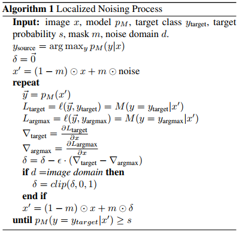

## 研究内容：
* Patch攻击的训练方式
* Patch的通用性
* Patch导致网络分类错误的原因

Brown提出的patch攻击尝试通过黑盒或者白盒方式生成一个通用的噪声可以加到任何的图像上。生成的对抗patch非常的大。用面积10%生成的patch可以对90%的image攻击生效。
本工作尝试找到当前SOTA的分类器的盲点，和导致模型分类错误的噪声类型。

实验分为针对网络域和图像域两种方式。对于网络域，噪声值不需要在图像表示范围内，可以取任意值；而对于图像域，噪声需要在图像表示范围内。

本文展示了在白盒设置下，可以生成局部的可察觉的噪声，噪声可以迁移到几乎任意的图像上，噪声大小占图像总大小2%，并且不覆盖原图像中的原来的主要目标，可以使得网络产生置信度很高的错误分类。网络域的成功率要高于图像域。

通过检测网络在有噪图像上的梯度，发现网络不会将识别到有噪patch作为错误分类的主要原因。后者甚至在网络域中也是如此。这与Brown提出的假设形成了对比，在该假设中，噪音对神经网络来说比现实世界中的物体“更为突出”。

训练生成的局部噪声具有通用性，可以应用于许多不同的图像和位置，但只适用于训练使用的模型。

## 针对单个图像、单个位置的局部噪声

**训练方法：** $\delta$表示将要贴到原图$x$上的噪声，$mask m \in \{0,1\}^n$用掩码表示噪声在原图上的位置，有噪声的图像表示为$(1-m) \bullet x - m \bullet \delta$.

损失函数：
$$\mathop {argmax}_{\delta}[M(y=y_{target} | (1-m) \bullet x - m \bullet \delta) - M(y=y_{source}|(1-m) \bullet x - m \bullet \delta)]$$

对应的训练算法：

**训练细节：**
在ImageNet上训练的预训练在inception V3网络。我们使用大小为299x299的图像，并对大小为42x42的正方形区域进行噪声处理，大约占图像像素的2%。为100个随机(图像、目标类别、位置)三联生成网络域噪声，位置选择在角落(我们关注角落，因为他们有最大的机会不覆盖图像的主要对象)。如果网络以至少90%的置信度将噪声图像分类到期望的目标类，我们认为噪声处理是成功的。对于每一幅图像，我们都对噪声进行训练，直到达到期望的置信度，或者说进行多达10,000次迭代。

**训练结果：** 在110种配置中，有79%的配置成功地产生了局域网络噪声。当放宽要求，使网络选择目标类作为argmax(但可能小于90%的概率)时，我们设法干扰了91%的配置。通过进一步放宽对源噪声以外的任何类别的分类标准，噪声成功达到98%。

**缺陷：** 产生的噪音是高度依赖于具体的图像和位置:试图把噪音朝任一方向移动单个像素，网络的分类结果就会恢复到原来的预测类别，同时置信度很高。试图将噪声移动到不同的图像上也是失败的，除非将源图像的每边大约25%像素的边界与噪声一起转移。

## 可迁移的局部噪声

**训练方法：** 在算法1的基础上扩展局部噪声处理，在每一次迭代中，从100幅图像的“训练集”中选择一个随机的图像x和一个随机的位置。将噪声应用到图像上，并在噪声上从源类x向共享目标类$y_{target}$进行梯度更新。在每个迭代相同的噪声应用于随机图像和位置，两者采样分别从均匀分布的可能图像和位置。这与Brown中提出的算法非常相似，只是损失函数有所不同。在预测模型连续30次迭代得到期望的置信度(即目标类概率≥0.9)时，停止噪声更新过程。

**图像域实验的结果：** 我们使用100幅图像来评估图像域噪声的性能。成功率有所降低,但仍然有效:只有28.3%的分类结果为置信度0.9以上的预测目标类,在74.1%的情况下,分类预测为目标类,而在78.9%导致源类的误分类。

特定的类是否能更好地充当“目标”类，使其在使用时更容易欺骗网络?

**结论：** 在不同的类之间有显著的差异。由于只覆盖ImageNet中所有可能类的一个小子集，所以只能假设像“火山”这样具有全局结构的类比像“棒球”这样具有局部结构的类对这个局部补丁更具挑战性。

## 网络感知到的噪声

Brown认为局部噪声之所以有效，是因为它比场景中看起来自然的物体更加突出，捕获了网络的所有注意力。为了检验这一论断，本工作取一些有噪声的图像，并试图“固定”噪声对分类输出的影响。

结论：模型无法理解和定位图像中的噪声。

## 结论

* 可见局部的噪声块，在没有覆盖到主要目标上时，只覆盖图像中2%的像素，也会导致最先图像分类器对标签进行错误分类。
* 同一个patch可以应用于任意的图像和位置，导致误分类到期望的目标类，且成功率很高。
* patch对模型来说不是显著区域，需要进一步研究分类错误的机理。